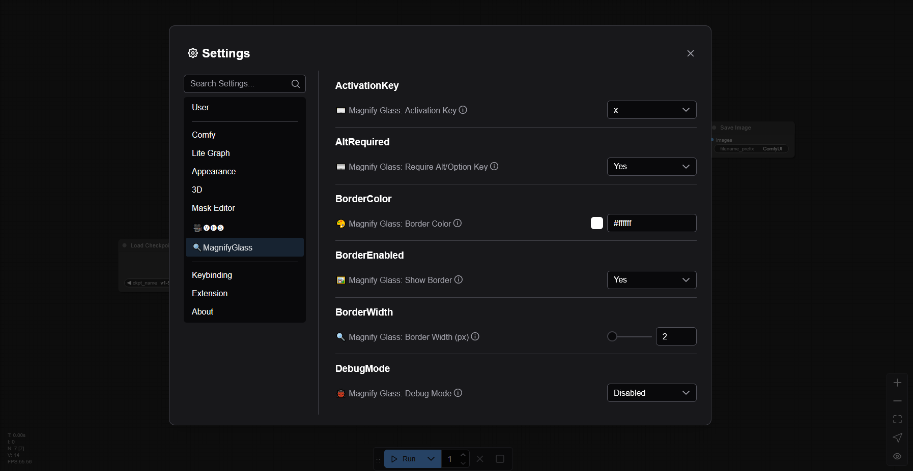

# ComfyUI-MagnifyGlass


**Enhance your ComfyUI workflow with a powerful and customizable magnifying glass!**

ComfyUI-MagnifyGlass adds an intuitive magnifying glass to your ComfyUI canvas, allowing you to zoom in on details with ease. Activate it with a simple key combination and customize its appearance and behavior to fit your needs.

> [!TIP]
> Perfect for inspecting fine details in your generated images, node connections, or any part of the ComfyUI canvas!


## ✨ Features

- **🔍 Smooth Zooming**: Magnify any part of the ComfyUI canvas with a configurable zoom factor.
- **🖱️ Cursor Interaction**:
    - **Follow Cursor**: Magnifier can follow your mouse movements.
    - **Fixed Position**: Alternatively, activate it at a specific spot.
    - **Precise Positioning**: Position the glass relative to the cursor (Top, Bottom, Left, Right, Corners).
- **🎨 Customizable Appearance**:
    - **Glass Size**: Adjust the diameter of the magnifying glass.
    - **Border Styling**: Enable/disable border, set custom border width and color.
    - **Glass Shape**: Choose between Circle, Square, or Rounded Square.
- **⌨️ Keyboard Controls**:
    - **Configurable Activation**: Set your preferred activation key (e.g., X, Z, M) with an optional Alt/Option modifier.
    - **Offset Adjustment**: Fine-tune the magnified view using arrow keys (Shift + Arrow for larger steps).
    - **Offset Reset**: Quickly reset the view offset with a configurable key (e.g., R, O) and optional Alt/Option modifier.
- **🛠️ WebGL Powered**: Efficient rendering using WebGL for smooth performance.
- **📝 Text Overlay**: Magnifies text within input widgets for better readability.
- **🐞 Debug Mode**: Optional debug overlay showing detailed information and a visualization of the source area.
- **⚙️ Settings Integration**: All options are configurable through the ComfyUI settings dialog.
- **💾 Persistent Offsets**: Manually adjusted offsets are saved and loaded across sessions.
- **🖼️ Texture Filtering**: Choose between Linear (smooth) and Nearest (pixelated) texture filtering for the magnified view.



## 📥 Installation

### Option 1: Using ComfyUI Manager

1.  Install [ComfyUI Manager](https://github.com/ltdrdata/ComfyUI-Manager) if you don't have it already.
2.  Open ComfyUI, go to the **Manager** tab.
3.  Click on **Install Custom Nodes**.
4.  Search for "**ComfyUI-MagnifyGlass**" and click **Install**.
5.  Restart ComfyUI.

### Option 2: Manual Installation

```bash
cd /path/to/ComfyUI/custom_nodes
git clone https://github.com/AEmotionStudio/ComfyUI-MagnifyGlass.git
```

Restart ComfyUI after installation. No additional `pip install` steps are typically required for JavaScript-based extensions.

## 🚀 Usage

1.  **Activation**:
    - By default, press and hold `Alt + X` to activate the magnifying glass.
    - The activation key and whether `Alt/Option` is required can be changed in the settings.
2.  **Using the Magnifier**:
    - While active, move your mouse over the ComfyUI canvas to see the magnified view.
    - If `Follow Cursor` is disabled, the magnifier will remain where it was activated.
3.  **Controls (while active)**:
    - **Arrow Keys**: Nudge the magnified view (adjusts `offsetX`/`offsetY`).
    - **Shift + Arrow Keys**: Nudge the magnified view by a larger step.
    - **Reset Key (default 'R')**: Resets `offsetX` and `offsetY` to zero. (Configurable, may require Alt/Option).
4.  **Configuration**:
    - Access all settings by clicking the ⚙️ (Settings) icon in ComfyUI, then find the "🔍 Magnify Glass" section.


*(Debug Menu & Arrow Keys Showcase: some flickering may aquire with the VHS Combine Node Preview when moving the glass across the preview service while active)*

## ⚙️ Configuration Options

All options are available in the ComfyUI settings dialog under the "🔍 Magnify Glass" section.

| Option                               | Description                                                                                               | Default Value    |
|--------------------------------------|-----------------------------------------------------------------------------------------------------------|------------------|
| **Zoom Factor**                      | Magnification level (e.g., 2.5 means 2.5x zoom).                                                          | `3`              |
| **Glass Size (px)**                  | Diameter of the magnifying glass in pixels.                                                               | `300`            |
| **Border Width (px)**                | Width of the border around the magnifying glass.                                                          | `2`              |
| **Border Color**                     | Color of the border around the magnifying glass.                                                          | `#ffffff`        |
| **Activation Key**                   | The key (case-insensitive) to hold down to activate the magnifier.                                        | `x`              |
| **Require Alt/Option Key**           | If Yes, Alt (Windows/Linux) or Option (Mac) must be held along with the activation key.                 | `Yes (true)`     |
| **Follow Cursor Position**           | If Yes, the magnifier window moves with the cursor. If No, it stays where activated.                      | `Yes (true)`     |
| **Offset Adjust Step (Graph Units)** | How many graph units the view shifts when pressing arrow keys (Shift+Arrow = 5x).                         | `5`              |
| **Reset Offset Key**                 | The key to press to reset the view offset while active.                                                   | `r`              |
| **Require Alt/Option for Reset**     | If Yes, Alt/Option must be held with the reset key.                                                       | `Yes (true)`     |
| **Debug Mode**                       | Show detailed logging and the debug visualization overlay.                                                | `Disabled (false)`|
| **Glass Position**                   | Position of the magnifying glass relative to the cursor.                                                  | `Bottom`         |
| **Shape**                            | Shape of the magnifying glass (Circle, Square, Rounded Square).                                           | `Circle`         |
| **Show Border**                      | Enable or disable the border around the magnifying glass.                                                 | `Yes (true)`     |
| **Texture Filtering**                | Controls how the magnified image is scaled. Linear is smoother, Nearest is sharper/pixelated.             | `Linear`         |

## ❓ Troubleshooting

-   **Magnifier not appearing**:
    -   Ensure you are pressing the correct activation key combination (check settings for current keys).
    -   Make sure ComfyUI has focus.
    -   Check the browser console (F12) for any errors related to "ComfyUI Magnifying Glass".
-   **Performance issues on very complex graphs**:
    -   While WebGL is used for efficiency, extremely complex scenes might still impact performance. Try reducing the `Glass Size` if issues occur.
-   **Text in widgets not sharp enough**:
    -   The HTML overlay feature aims to render text crisply. If you notice issues, ensure your browser zoom is at 100%.

## 🤝 Contributing

Contributions are welcome! Whether it's bug reports, feature suggestions, or pull requests, your help is appreciated.

1.  Fork the repository.
2.  Create a new branch (`git checkout -b feature/AmazingFeature`).
3.  Make your changes.
4.  Commit your changes (`git commit -m 'Add some AmazingFeature'`).
5.  Push to the branch (`git push origin feature/AmazingFeature`).
6.  Open a Pull Request.

## 🙏 Acknowledgements

-   The ComfyUI team for creating such a flexible and powerful platform.
-   The LiteGraph.js library.
-   Users and contributors who provide feedback and suggestions.

## 🔗 Connect with Me (Developer)

- YouTube: [AEmotionStudio](https://www.youtube.com/@aemotionstudio/videos)
- GitHub: [AEmotionStudio](https://github.com/AEmotionStudio)
- Discord: [Join our community](https://discord.gg/UzC9353mfp)
- Website: [aemotionstudio.org](https://aemotionstudio.org/)

## ☕ Support

If you find ComfyUI-MagnifyGlass useful, consider supporting its development:

[](https://ko-fi.com/aemotionstudio)

Your support helps me dedicate more time to maintaining and improving this project and others with new features, bug fixes, and better documentation.

### 💖 Additional Ways to Support

- ⭐ Star the repository
- 📢 Share it with others
- 🛠️ Contribute to its development

For business inquiries or professional support, please contact me through my [website](https://aemotionstudio.org/) or join my [Discord server](https://discord.gg/UzC9353mfp).

## 📜 License

This project is licensed under the **GNU General Public License v3.0**.
See the [LICENSE](LICENSE) file for details. 
